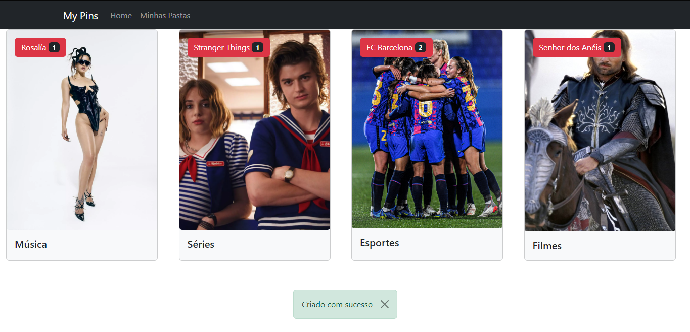

# Projeto My Pins

Projeto desenvolvido durante o Módulo de React do curso de Desenvolvimento Web do Instituto Nu + Descomplica, ministrado pelo prof.º <a href="https://github.com/ayrtonteshima">Ayrton Teshima</a>

## 👩‍💻 O Projeto 

Criamos o My Pins, uma aplicação que permite que você salve o pin em pastas que ficam armazenadas no Local Storage. Para desenvolvermos o app, consumimos os pins de maneira que simulasse uma API, as pastas são criadas pelo usuário e não permitem que um pin seja salvo múltiplas vezes na mesma pasta ao desabilitar o botão, além de modais ára salvar o pin e criar pastas. As pastas criadas e a quantidade de pins que possuem também podem ser conferidas na rota "Minhas Pastas".

## 🔧 Tecnologias Usadas

- JSX
- Javascript
- ReactJS
- React Bootstrap
- React Hooks

## 🔗 Acesso 

Para acessar o My Pins, basta <a href="https://my-pins.vercel.app/" target="_blank">clicar aqui</a>!

##  📱 Demo

| Versão Desktop |
| -------------- |
|  |
